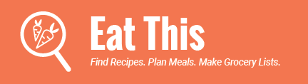

# Eat This

A Web App built to help you find recipes, fit them into a meal plan, and add their ingredients to shopping lists.
Features include:  
* Uses Edamam API to retrieve information about recipes 
* Search for recipes based on an ingredient  
* Displays recipe cards that can schedule the recipe into your meal plan 
* Users can add recipe ingredients to a shopping list 
* Users can add and remove items from the grocery list 
* Responsive Design 
* Custom logo made by me :) 
     
## Deployed On Netlify - <a href="https://eat-this-abbyw.netlify.app/">Eat This</a>

<a href="https://eat-this-abbyw.netlify.app/">Eat This</a>

Eat this as a tool used to find recipes, plan your weekly meals, and to make grocery lists based on those recipes. 
 
 
The Search page floods with recipes on recipe cards, and a search box taking input to search for recpies. 
 
 
Recipe cards show info about the recipe, each with an overlay that lets you add the recipe to your meal plan or shopping list 
 
 
Meal Plan shows you what you will eat on a weeekday basis based on what youve selected on the Search tab. 
 
 
The Shopping list is a list made from all the recipes added on the Search tab. 
 
 
Responsive Design all throughout 
 
 

## Tech used
* React
* Javascript
* HTML & CSS
* React Router
* Sass
* CRUD
* API
* Responsive Design

## About Me
Thank you for checking out my work, I hope you enjoyed my site!  
I'm currently searching for a new career opportunity in Web Development and would love to hear from you, so feel free to reach out.  
These are my socials:  
<a href="mailto:Wabby.404@gmail.com">Wabby.404@gmail.com</a>  
<a href="https://wabby404.github.io/portfolio-redo/">Portfolio Site</a>  
<a href="https://github.com/WAbby404">Github</a>  
<a href="https://www.linkedin.com/in/abbywaddell4042/">Linkedin</a>  

